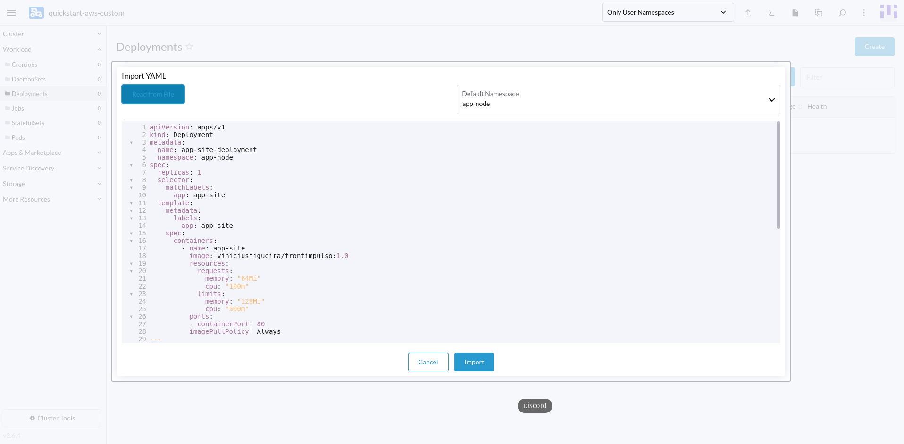

# Provisionamento do Rancher em instâncias EC2

## Pré requisitos:
1. Conta AWS com permissões necessárias para realizar o provisionamento dos serviços. 
2. Terraform CLI

## Procedimento: 

Após realizar o comando "git clone https://github.com/viniciusfigueira/Rancher-EC2-Terraform.git".
Será necessário realizar a inclusão das suas credenciais AWS para poder executar o código Terraform.
O arquivo que deve ser alterado é o "terraform.tvars" dentro da pasta "AWS". 
Nele iremos colocar a Access Key :3 / Secret Key :6 / Senha de acesso no Rancher :9 /Aws_Region :15
* Onde os ":x" significa a linha para alteração

Após preenchermos esses requisitos iremos rodar o código com os seguintes comando dentro da pasta /aws

```terraform init
terraform apply --auto-approve
```

Após rodarmos esses comando o ambiente será iniciado e teremos o endpoint para acesso no output de saida
Para entrar no ambiente Rancher basta acessar o endpoint inserindo o usuário=admin e senha= "Definifida pelo usuário no momento de subir o ambiente"


Com isso temos o ambiente funcionando e podemos realizar o deploy dentro do ambiente. Neste cenário será utilizado uma pagina web como exemplo.


Iremos acessar a pasta de deployments dentro do cluster


Iremos acessar o cluster pelo terminal CLI e criar um namespace com o seguinte comando

```kubectl create namespace app-node
```

Após isso temos duas opções para realizar o deploy, sendo elas, por CLI acessando o cluster no canto superior direito, ou importando o arquivo YAML(deployment.yaml), também no canto superior direito. Segue a imagem com os dois métodos.
*Lembrando que por CLI é necessário aplicar o seguinte comando:
```kubectl apply -f - <<EOF
{arquivo-yaml}
EOF
```


Realizando pelo modo gráfico ficará assim, lembrando de selecionar o namespace (app-node):



Para acessarmos o ambiente após o deploy pegamos o IP público do node e acessamo pelo browser.


Após seguir esses passos o esperado é termos uma página web funcionando

